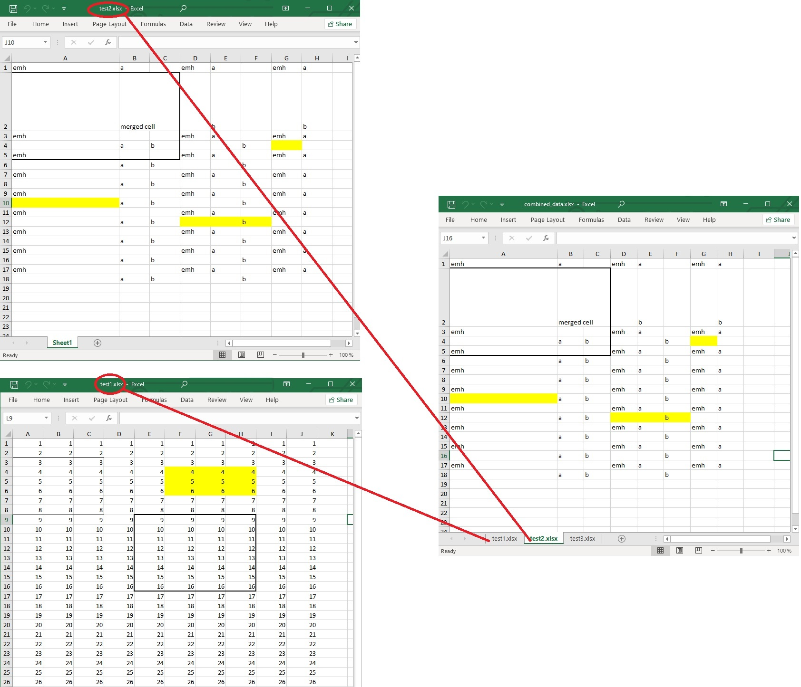

This repository is useful if you need to combine many Excel files into one file. Where the names of the sheets match the names of the input Excel files.

How to use

- Jjust specify the path to the folder where the xlsx files that you want to merge
- inputFolder = "path"; //change to your path to the folder with xlsx files
- run MergeExcelFiles

Example

The resulting file retains the style and formatting of the source files.
Important - the image is not transferable.

- 